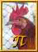

<!--
SPDX-FileCopyrightText: 2019-2020 Tuomas Siipola
SPDX-FileCopyrightText: 2020 Johannes Siipola

SPDX-License-Identifier: AGPL-3.0-or-later
-->

# Perceptual Image Optimizer 


[](https://reuse.software)

`pio` is a command-line utility to compress image files while maintaining the same perceived quality.
It's designed primarily to optimize photographs for the web.

## Features

- Optimize images automatically for the web
- Supports PNG, JPEG and WebP
- Powered by great projects like [mozjpeg](https://github.com/mozilla/mozjpeg) and [pngquant](https://pngquant.org/)
- Easily installable statically-linked binary (for Linux and macOS)

`pio` is still under development but should be usable for most images.
It lacks some important features like proper color management support.

## Background

Images are an important part of the web and make up a large part of the typical website (see HTTP Archive's [Page Weight](https://httparchive.org/reports/page-weight) for statistics).
Optimizing images can make websites faster to load and reduce the required bandwidth.

How much should you optimize images?
Many image editors and optimization tools only give you parameters such as quality or file size.
You could use the same parameters for each image.
This will certainly optimize your images but may not be optimal for all images.
You could also specify parameters by hand for each image but this isn't feasible if there are many images, or if images are uploaded by end users.

`pio` simplifies image optimization by finding optimal parameters automatically.
This is done by optimizing the input image with different qualities and comparing [structural similarity (SSIM)](https://en.wikipedia.org/wiki/Structural_similarity).

### Example

Here we can see that `pio` finds different quality parameter for different images (using default settings).
In general images with a lot of details require higher quality than those with fewer details.

However, `pio` is not perfect: for example some JPEG artifacts are visible in the first example image.
In this case the quality setting is optimized for the solid sky covering most of the image but not the finer details of the bridge.

| Original                                                                                                                                                                                                                                                                          | Optimized JPEG                                                           | Optimized WebP                                                           |
| -                                                                                                                                                                                                                                                                                 | -                                                                        | -                                                                        |
| <br>Photo: [Josh Felise](https://www.snapwi.re/user/JPFelise)<br>[CC0 1.0](https://creativecommons.org/publicdomain/zero/1.0/) &bullet; [Source](https://snapwiresnaps.tumblr.com/post/140752672614/josh-felise-free-under-cc0-10-download)        | <br>**File size:** 2.1 KiB<br>**Quality:** 75 | <br>**File size:** 2.0 KiB<br>**Quality:** 83 |
| <br>Photo: [Dominik Martin](https://www.snapwi.re/user/dominikmartn)<br>[CC0 1.0](https://creativecommons.org/publicdomain/zero/1.0/) &bullet; [Source](https://snapwiresnaps.tumblr.com/post/102447448703/dominik-martin-wwwdominikmartin-free)   | <br>**File size:** 5.5 KiB<br>**Quality:** 88 | <br>**File size:** 5.7 KiB<br>**Quality:** 89 |
| <br>Photo: [Michael Day](https://www.snapwi.re/user/bucktownchicago)<br>[CC0 1.0](https://creativecommons.org/publicdomain/zero/1.0/) &bullet; [Source](https://snapwiresnaps.tumblr.com/post/171101090646/michael-day-free-under-cc0-10-download) | <br>**File size:** 21 KiB<br>**Quality:** 95  | <br>**File size:** 15 KiB<br>**Quality:** 81  |

## Installation

### Linux

Download the latest Linux binary from [GitHub releases](https://github.com/siiptuo/pio/releases).

There are two versions: glibc and musl.
glibc version is about 50% faster than musl version but may not work on old and non-glibc-based distributions.
For reference, the glibc version is built on Ubuntu 16.04 against glibc 2.23.

After downloading the binary, run `chmod +x path-to-pio` to make it executable.
Consider storing the binary somewhere on your `PATH` like `/usr/local/bin/pio`.

### macOS

Download the latest macOS binary from [GitHub releases](https://github.com/siiptuo/pio/releases).

After downloading the file, run `chmod +x path-to-pio` in your terminal to make it executable.
Now try running `./path-to-pio --version`.

If you get an error like "pio cannot be opened because the developer cannot be verified", open "System Preferences" section "Security & Privacy" tab "General" and click "Allow Anyway".
Now you should be able to run `pio`.
For more information, see [Safely open apps on your Mac](https://support.apple.com/en-us/HT202491) by Apple.

### Building from source

Download source code from [GitHub releases](https://github.com/siiptuo/pio/releases) or clone this repository for development version.
Compiling `pio` requires Rust and C toolchains.
Run `cargo build --release` to build binary at `target/release/pio`.

## Usage

Basic usage:

```sh
$ pio input.jpeg --output output.jpeg
```

The target quality can be set using `--quality` option:

```sh
$ pio input.jpeg --quality 95 --output output.jpeg
```

The target quality is a value between 0 and 100 and roughly corresponds to JPEG quality values.

For the full list of available options, run `pio --help`.

### Input images

`pio` works by comparing the optimized image to the input image.
The input image should preferably be PNG or lossless WebP, or alternatively JPEG or lossy WebP stored with a high quality setting (95-100).
`pio` will make already lossy compressed images look worse.

For the web, the first and most important optimization is resizing images close to the size they're displayed at.
For the best result, first resize a high-resolution source image and store the resulting image with lossless compression.
Only after this, optimize the resized image with `pio`.

For example with the help of [ImageMagick](https://imagemagick.org/index.php) you could resize and optimize an image:

```sh
$ magick big.jpeg -resize 640x small.png
$ pio small.png --output optimized.jpeg
```

Most likely you also want to use [responsive images](https://developer.mozilla.org/en-US/docs/Learn/HTML/Multimedia_and_embedding/Responsive_images) where you create multiple differently sized images for different display resolutions.
You should do the resizing and optimization for each size independently.

### Quality setting explained

`pio` uses an internal table to map target `--quality` setting to SSIM value.
This table has been calculated by running a corpus of images through JPEG encoder and calculating the average SSIM value for each JPEG quality setting.

This makes it possible to target the quality using a familiar 0-100 scale instead of a more obscure SSIM value.

`pio` sets the minimum and maximum quality automatically based on the `--quality` option.
You can control the quality spread from the target using the `--spread` option. For example the following command:

```sh
$ pio input.jpeg --quality 80 --spread 10 --output output.jpeg
```

will target JPEG quality of 80 with the minimum quality of 70 and maximum quality of 90.
The final quality setting will be selected by the SSIM calculation and it will depend on the complexity of the image.

If you need, you can override this automatic calculation by specifying `--min` and/or `--max` values manually.

## Links

### Integrations

`pio` provides just a command-line interface but there exists integrations for the following systems

- [pio-loader](https://github.com/siiptuo/pio-loader): webpack integration

### Alternatives

`pio` is not really doing anything new and there are many similar projects including

- [Guetzli](https://github.com/google/guetzli/)
- [Imager](https://github.com/imager-io/imager)
- [imgmin](https://github.com/rflynn/imgmin)
- [optimal-image](https://github.com/optimal-image/optimal-image)
- [webp-recompress](https://github.com/AgentCosmic/webp-recompress)
- `jpeg-recompress` from [JPEG Archive](https://github.com/danielgtaylor/jpeg-archive/)

### Reading

- Essential Image Optimization ([mirror](https://joppuyo.github.io/images-guide-mirror/), [wayback machine](https://web.archive.org/web/20200424075529/https://images.guide/)) is a good introduction to different image formats and optimization techniques
- [Is WebP really better than JPEG?](https://siipo.la/blog/is-webp-really-better-than-jpeg) compares different images formats at the same SSIM index

## License

GNU Affero General Public License version 3 or later
